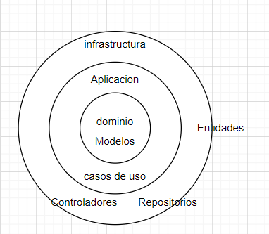
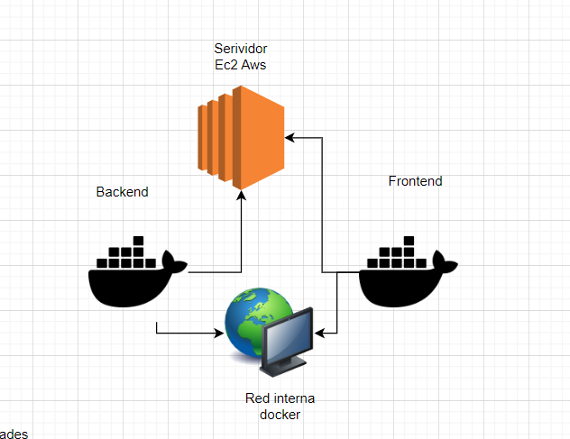

# Test Ficohsa

## Descripción
Es una aplicación Spring Boot desarrollada para buscar items atraves de una API REST.

## Características
- **Spring Boot 3.2.1**: Framework para facilitar la configuración y despliegue.
- **Java 17**: Versión del lenguaje de programación.
- **H2**: Base de datos en memoria para almacenar los items.
- **Swagger UI**: Interfaz de usuario para interactuar fácilmente con la API.
- **Docker**: Se utiliza docker para la contenerizacion de la aplicacion.
- **Docker-compose**: Se utiliza docker-compose para la gestion de los contenedores.
- **Amazon-EC2**: se utiliza un servidor virtual ec2 para el despliegue de la aplicacion.

## Metodología y[README.md](README.md) Principios de Desarrollo
- **Arquitectura Hexagonal**: Utilizada para separar las preocupaciones en capas claramente definidas, facilitando la escalabilidad y mantenimiento.
- **Desarrollo Guiado por el Dominio (DDD)**: Empleando un enfoque centrado en el dominio para mejorar la claridad y la lógica del negocio.
- **Principios SOLID**: Seguidos para promover un diseño de software orientado a objetos limpio y mantenible.

## Estructura de la aplicacion

- **1**: La aplicacion de divide por capas las cuales son.
- **Aplication**: en esta tendremos todos los caso de uso
- **Dominio**: en esta tendremos todos los modelos,utilidades o servicios
- **Infrastrutura**: En esta tendremos los controladores,repositorios,entidades

como vemos en este pequeño diagrama



## Despliegue de la aplicacion
- **1**: La aplicacion se deplego usando una maquina ec2 de aws y usando docker.
- **red-docker**: Se crea una red local de docker por la cual el front gracias que 
se usa nextjs se comunica directamente con los servicios y entrega las pantallas por server y renderiza las pantallas por
Server-side Rendering




## Requisitos
- Java 17

## Configuración y Ejecución
### Configuración Local
1. Clonar el repositorio.
2. Ejecutar el proyecto utilizando el comando Gradle:
   ```shell
   ./gradlew bootRun

## Uso de la API
La aplicación expone dos endpoints principales:
1. **GET /api/v1/items/:id**: Busca item por un id especifico.
   - **Cuerpo de la petición**: JSON con los campos del item.
   - **Respuesta**: JSON con el resultado.

2. **GET /api/v1/items/search?name=da&total=1**: Busca items por un parmetro de busqueda y muestra un total maximo dado.
   - **Respuesta**: JSON con el resultado.

La documentación detallada de la API y los esquemas de solicitud y respuesta están disponibles a través de la interfaz de [Swagger](http://52.21.129.164:8081/api/v1/swagger-ui/index.html#/).

## Pruebas
Las pruebas unitarias se pueden ejecutar mediante el comando:
1. *Ejecuón de pruebas:*
   ```shell
   ./gradlew test